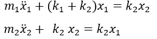

A two degree of freedom system can be defined as a system, that requires two independent variables to describe its position from the equilibrium. It has two equations of motion i.e., for two masses or for each degree of freedom. It introduces the coupling phenomenon where the motion of any one of the two independent coordinates is dependent on the other, through the coupling springs or dash-pots.
Consider an ideal two degrees of freedom system as shown in Fig 1, where the masses are constrained to move in the direction of the spring axes. Let $x_1$ and $x_2$ be the displacements of the masses at any instant measured from the equilibrium positions of these masses respectively, which are positive in the direction shown. Let’s assume $X_2$ > $X_1$.

  
<!--  -->
 
Fig 1.(a) A schematic representation of Spring mass system          (b) and its free body diagram

Then the spring forces acting on these masses are shown below, giving us the following differential equations:

<!--  -->

$m_1 \ddot{x}\_1 + k_1 x_1 + k_2 (x_1 - x_2) = 0$

$m_2 \ddot{x}\_2 + k_2 (x_2 - x_1) = 0$

 
On re-arranging the equations,

<!--  -->

$m_1 \ddot{x}_1 + (k_1 + k_2) x_1 = k_2 x_2 $

$m_2 \ddot{x}_2 + k_2 x_2 = k_2 x_1$

Assuming the solutions for $x_1$ and $x_2$ to be harmonic in nature under steady state conditions.

When mass $m_1$ and $m_2$ executes harmonic vibration at frequency $\omega$,

<!--  -->

$x_1 = X_1 \sin(\omega t)$   
$x_2 = X_2 \sin(\omega t)$

Substituting the above equation in the differential equations and cancelling out the common terms $\sin(\omega t)$.  

<!--  -->

$[-m_1 \omega^2 + (k_1 + k_2)] X_1 = k_2 X_2$  
$[-m_2 \omega^2 + k_2] X_2 = k_2 X_1$

  

These equations will give the following two equations respectively,

<!--  -->

$\frac{X_1}{X_2} = \frac{k_2}{[(k_1 + k_2) - m_1 \omega^2]}$   
$\frac{X_1}{X_2} = \frac{[k_2 - m_2 \omega^2]}{k_2}$

 
From the above two equations, we have

<!--  -->

$\frac{k_2}{[(k_1 + k_2) - m_1 \omega^2]} = \frac{[k_2 - m_2 \omega^2]}{k_2}$

 
On Solving,

<!--  -->

$[(k_1 + k_2) - m_1 \omega^2][k_2 - m_2 \omega^2] = (k_2)^2$

Or,

<!--  -->

$m_1 m_2 \omega^4 - [m_1 k_2 + m_2 (k_1 + k_2)] \omega^2 + k_1 k_2 = 0$

The above equation is quadratic in $\omega^2$ and gives two values of $\omega^2$, and therefore two positive values of $\omega$ corresponding to two natural frequencies $\omega_{n1}$ and $\omega_{n2}$ of the system. The above equation is called the frequency equation since the roots of this equation gives the natural frequencies of the system.

The amplitude ratio of two equations,

<!--  -->

$\frac{k_2}{[(k_1 + k_2) - m_1 \omega^2]} = \frac{[k_2 - m_2 \omega^2]}{k_2}$

If in either of the equations, on substituting for $\omega$ the value of $\omega_{n1}$ , we have the first mode shape of the system i.e., when the system is vibrating with the first natural frequency $\omega_{n1}$, the mode shape is such that the ratio of the amplitude of two masses is equal to the solution of above equation.

Similarly, in either of the equations, substituting for $\omega$ the value of $\omega_{n2}$, we have the second mode shape of the system i.e., when the system is vibrating with the second natural frequency $\omega_{n2}$, the mode shape is such that the ratio of the amplitude of two masses is equal to the solution of above equation.

If the initial excitation given to both masses be $X_{o1}$ and $X_{o2}$. For finding equation of motion for both masses, if the initial excitation given for both masses are different (i.e., $X_{o1}$ ≠ $X_{o2}$), then the formula for equation of motion is:

<!--  -->

$x_1 = X'_1 \cos(\omega_{n1} t) + X''_1 \cos(\omega_{n2} t)$  

$x_2 = X'_2 \cos(\omega_{n1} t) + X''_2 \cos(\omega_{n2} t)$

 
Where,

<!--   -->

$\frac{X'_1}{X'_2} = \frac{X_1}{X_2} \quad \text{at } \omega_{n1}$

 <!--  -->

$\frac{X''_1}{X''_2} = \frac{X_1}{X_2} \quad \text{at } \omega_{n2}$

And,
 
$X'_1 + X''_1$ is the initial displacement of $m_1$
 
$X'_2 + X''_2$ is the initial displacement of $m_2$

Cases:

1. When we give same initial excitation for both masses in same direction (i.e., $X_{o1}$ = $X_{o2}$), then the system will vibrate in smaller natural frequency (i.e. $\omega_{n1}$ ). Then the condition changes as:

<!--  -->

$X'_2 = X_{02}$  

$x_1 = X'_1 \cos(\omega_{n1} t) \quad \text{and} \quad x_2 = X'_2 \cos(\omega_{n1} t)$

  

Where,

<!--  -->

$\frac{X'_1}{X'_2} = \frac{X_1}{X_2} \quad \text{at } \omega_{n1}$

When we give same initial excitation for both masses in different direction (i.e., $X_{o1}$ = -$X_{o2}$), then the system will vibrate in larger natural frequency (i.e.$\omega_{n2}$ ). Then the condition changes as:

<!--  -->

$X''_2 = X_{o2}$  
$x_1 = X''_1 \cos(\omega_{n2} t) \quad \text{and} \quad x_2 = X''_2 \cos(\omega_{n2} t)$

Where,

<!--  -->

$\frac{X'_1}{X'_2} = \frac{X_1}{X_2} \quad \text{at } \omega_{n1}$

Under certain condition, at any point, the system may execute harmonic vibrations at any of the two natural frequencies, and these are known as the principal modes of vibration. A system having two degrees of freedom can vibrate in two principal modes of vibrations corresponding to its two natural frequencies, the mode shapes being given by either of the equations after substituting for $\omega$ the corresponding value of natural frequency.
