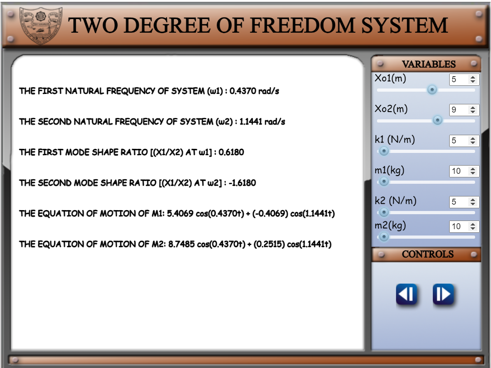
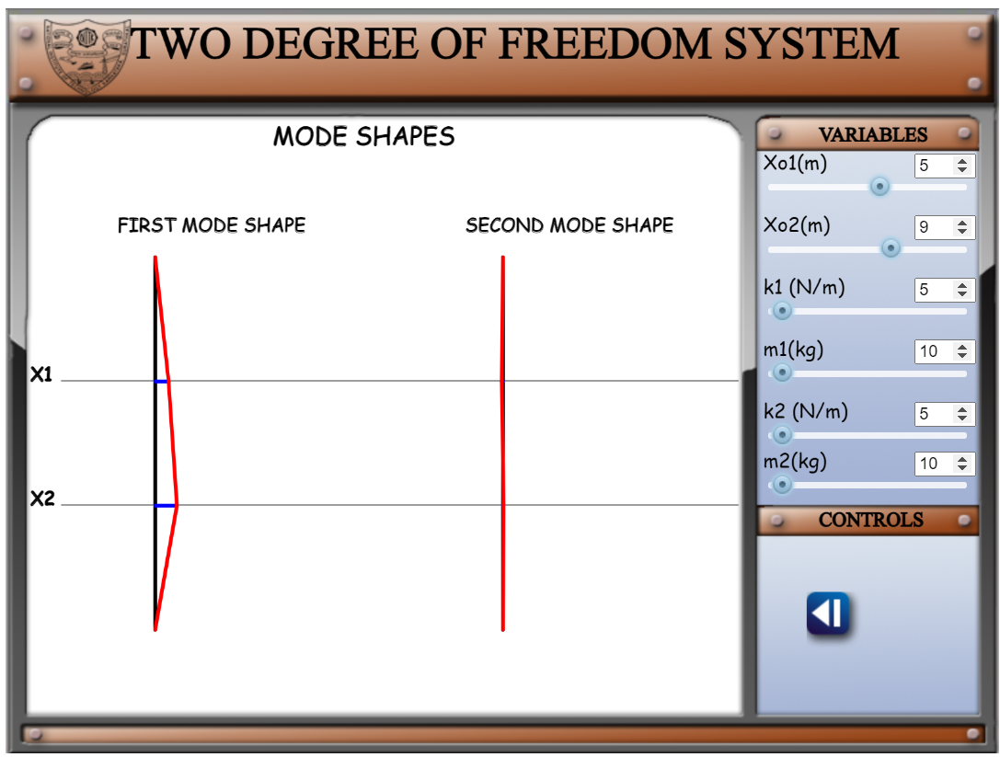

## Assumptions
•	The springs have no masses.
 
•	No dampers are provided.

## Description

1.	At first page, the page will be displayed as shown below:

 
2. Change the values of initial excitation given to masses m1 and m2 (Xo1 and Xo2). So that, the motion of masses will be initiated to the input given.

 

3.	You can change the stiffness constants k1 and k2, value of masses m1 and m2 according to your convenience and can check the output response of system.

4. You can pause the animation by clicking the    button.

5.	To play the animation again, click    button.

6.	If you want to check the values of natural frequencies, their respective mode shape ratios and equation of motion of masses m1 and m2, you can click    button. The representation of second page is shown below:

7.	If you want to go back, Click    button.

8.	If you want to go further to see the mode shapes of system, Click    button. The representation of third page is shown below.

